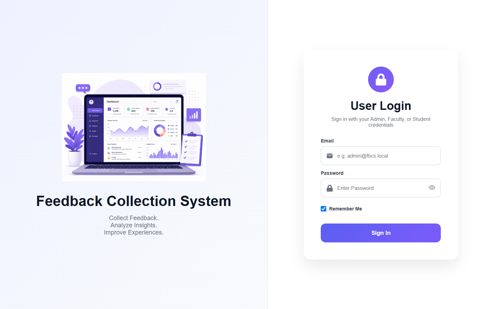
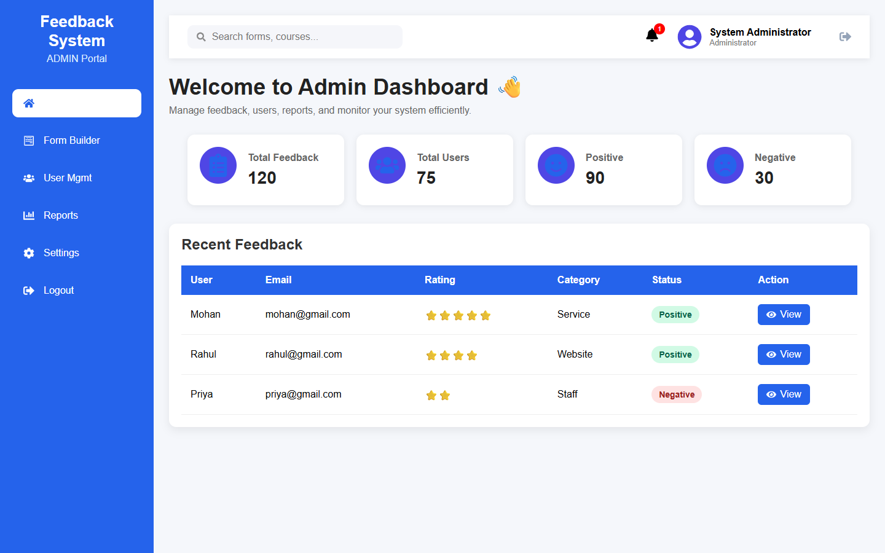
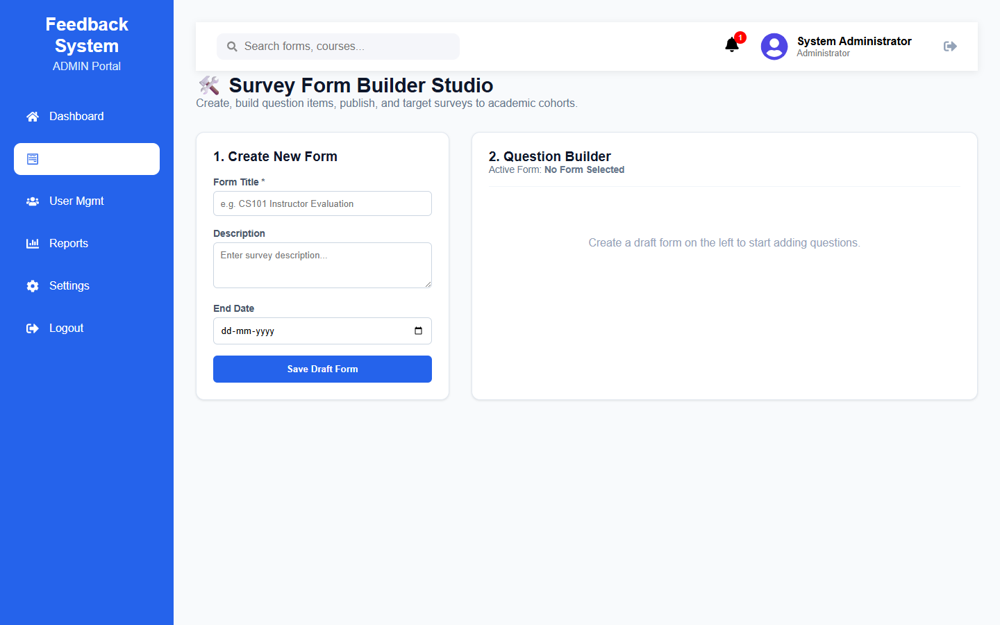
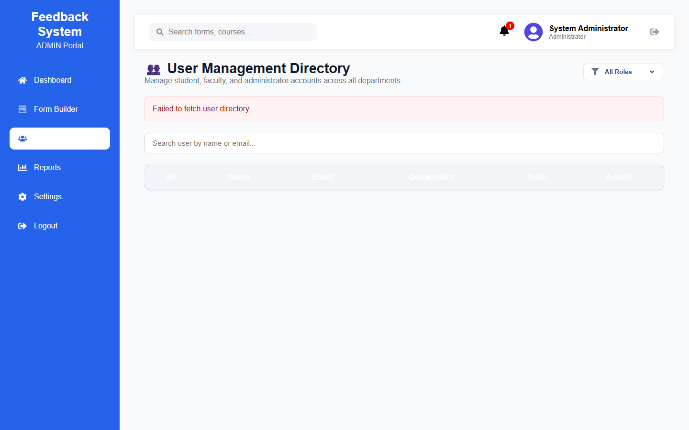
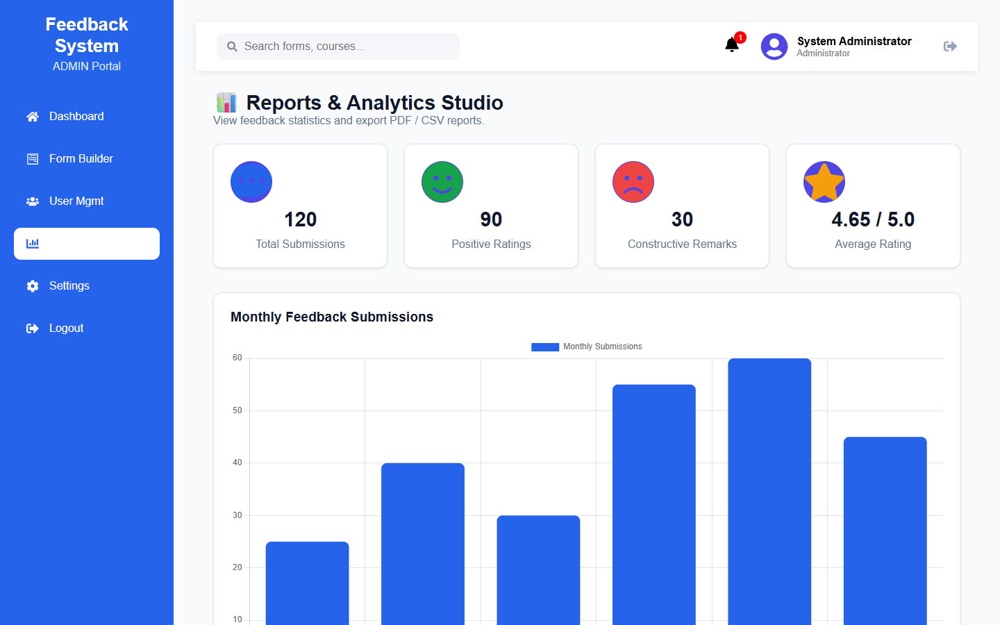
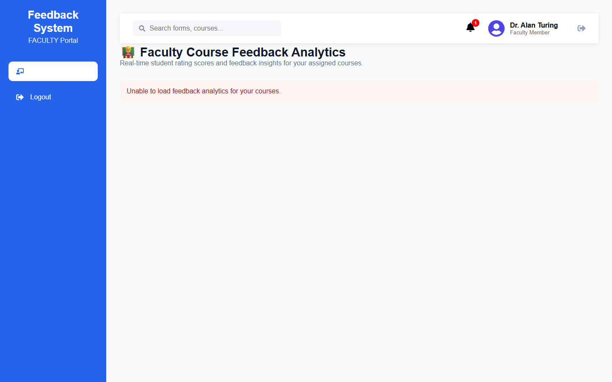
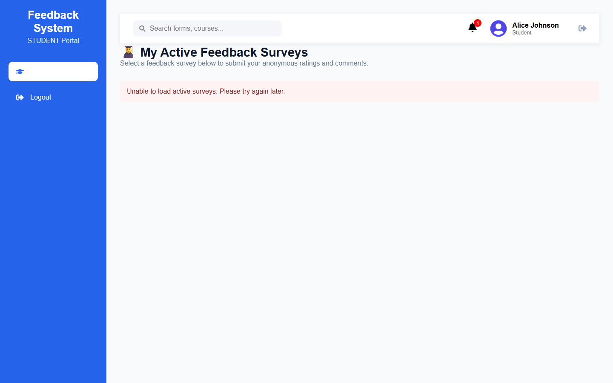
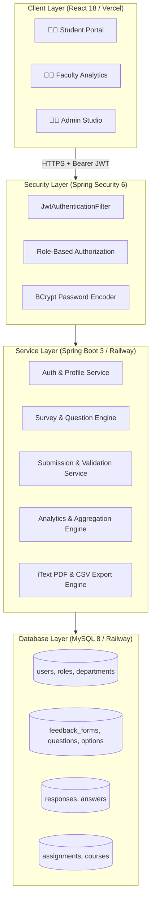
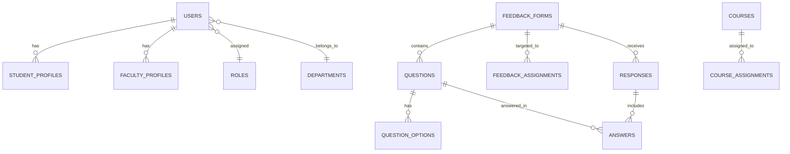

# 🎓 Feedback Collection System (FBCS)

[](https://spring.io/projects/spring-boot)
[](https://reactjs.org/)
[](https://www.mysql.com/)
[](https://jwt.io/)
[](https://railway.app/)
[](https://vercel.com/)
[](https://github.com/)

> An enterprise-grade, secure, role-based Feedback Collection and Course Evaluation platform engineered with **Spring Boot 3**, **React 18**, and **MySQL**.

---

## 📸 Application Screenshots

### 🔐 Unified Authentication Portal


### 📊 Administrator Executive Dashboard


### 🛠️ Survey Form Builder Studio


### 👥 User Directory & Role Management


### 📈 Reports & PDF/CSV Export Portal


### 👨‍🏫 Faculty Course Feedback Analytics


### 👨‍🎓 Student Active Surveys & Evaluation Portal


---

## 🏛️ System Architecture



---

## 🗄️ Database Schema & Relationships



---

## 🌟 Key Role Capabilities

| Role | Target Portal | Core Permissions & Functionality |
| :--- | :--- | :--- |
| **👨‍💼 Administrator** | `/dashboard`<br>`/form-builder`<br>`/users`<br>`/reports` | • Build dynamic forms with Star Ratings, Radio options, Checkboxes, and Text questions.<br>• Target academic cohorts by Department (`CSE`, `ECE`, `MECH`), Semester, and Section.<br>• Publish draft forms to active status.<br>• Manage user directory with role filtering and soft-deactivation.<br>• One-click export of executive PDF summary reports and CSV datasets. |
| **👨‍🏫 Faculty Member** | `/faculty-analytics` | • Real-time course feedback rating score (e.g. `4.65 / 5.0`).<br>• Response volume and participation rate analytics.<br>• Review qualitative student comments with guaranteed student anonymity. |
| **👨‍🎓 Student** | `/student-surveys`<br>`/take-survey/:id` | • Access surveys assigned to student's department and semester.<br>• Submit anonymous evaluations with interactive 5-star ratings and feedback.<br>• Automatic prevention of duplicate submissions. |

---

## 🏗️ Technology Stack Breakdown

| Component | Technology | Description |
| :--- | :--- | :--- |
| **Frontend UI** | React 18 SPA | Built with React Router v6, Axios, and React Icons. |
| **State Management** | Context API (`AuthContext`) | Manages JWT token lifecycle, session persistence, and role state. |
| **Data Visualization** | Chart.js & `react-chartjs-2` | Interactive feedback analytics charts and response trends. |
| **Backend REST API** | Spring Boot 3.5.x | Java 17 enterprise REST architecture with Spring Data JPA. |
| **Security & Auth** | Spring Security 6 & JWT | Stateless HMAC-SHA256 tokens and BCrypt (`$2a$10$...`) hashing. |
| **Relational Database** | MySQL 8.x | 15 relational tables with foreign keys and soft-deletions. |
| **Reporting Engine** | OpenPDF / iText & OpenCSV | Real-time binary PDF streaming and formatted CSV export. |
| **Cloud Hosting** | Railway & Vercel | Multi-stage Docker container on Railway + Single Page App on Vercel. |

---

## 🔑 Default Demo Accounts

The system automatically seeds initial accounts on first startup:

| Role | Email | Password | Accessible Portals |
| :--- | :--- | :--- | :--- |
| **👨‍💼 Administrator** | `admin@fbcs.local` | `admin123` | Dashboard, Form Builder, Users, Reports |
| **👨‍🏫 Faculty** | `faculty@fbcs.local` | `faculty123` | Course Feedback Analytics |
| **👨‍🎓 Student** | `student@fbcs.local` | `student123` | My Surveys & Submission Portal |

---

## 🚀 Quick Start (Local Setup)

### Prerequisites
- **Java 17+** & **Maven**
- **Node.js 18+** & **npm**
- **MySQL 8+** running on `localhost:3306`

---

### 1. Backend Setup

```bash
# Clone the repository
git clone https://github.com/shyamsunderreddypolu/feedback-collection-system.git
cd feedback-collection-system

# Run Spring Boot backend
./mvnw spring-boot:run
```
> Backend starts on **`http://localhost:8080`**.

---

### 2. Frontend Setup

```bash
# Navigate to frontend folder
cd frontend

# Install dependencies
npm install

# Start React development server
npm start
```
> Frontend launches on **`http://localhost:3000`**.

---

## 🌐 Production Cloud Deployment

### 1. Backend on Railway
1. Provision a **MySQL** database on [Railway](https://railway.app/).
2. Deploy the Spring Boot application using the included multi-stage `Dockerfile`.
3. Railway automatically binds database connection variables (`MYSQLHOST`, `MYSQLPORT`, `MYSQLDATABASE`, `MYSQLUSER`, `MYSQLPASSWORD`) and dynamic `${PORT}`.

### 2. Frontend on Vercel
1. Import the repository on [Vercel](https://vercel.com/) with root directory set to `frontend/`.
2. Add environment variable:
   - `REACT_APP_API_BASE_URL` = `https://<your-railway-backend-url>/api`
3. Click **Deploy**.

---

## 📡 REST API Reference

### 🔐 Authentication
- `POST /api/auth/login` - Authenticate credentials and issue JWT token
- `POST /api/auth/register` - Register a new user account

### 📝 Survey Forms & Questions
- `GET /api/forms/active` - Fetch active surveys for logged-in user
- `POST /api/forms` - Create draft feedback form *(Admin)*
- `PUT /api/forms/{id}/publish` - Publish feedback form *(Admin)*
- `POST /api/questions` - Add dynamic question item *(Admin)*
- `POST /api/assignments` - Assign form to academic cohort *(Admin)*

### ✍️ Submissions & Analytics
- `POST /api/submissions` - Submit survey response *(Student)*
- `GET /api/analytics/faculty/{facultyId}` - Get aggregate ratings & comments *(Faculty/Admin)*
- `GET /api/reports/export/pdf` - Download PDF Report *(Admin)*
- `GET /api/reports/export/csv` - Download CSV Dataset *(Admin)*

### 👥 User Management
- `GET /api/users/active` - List all active users
- `GET /api/users/role/{role}` - Filter users by role (`ROLE_STUDENT`, `ROLE_FACULTY`, `ROLE_ADMIN`)
- `DELETE /api/users/{id}` - Soft-deactivate a user account

---

## 🧪 Testing & Verification

```bash
# Run full automated test suite
./mvnw test
```

- **Automated Tests**: **`134 / 134 PASSED (100%)`** across Controllers, Services, Security, and DTOs.
- **End-to-End Manual QA**: Complete 11-step verification flow tested and validated.

---

## 📄 License

This project is open source and available under the [MIT License](LICENSE).
