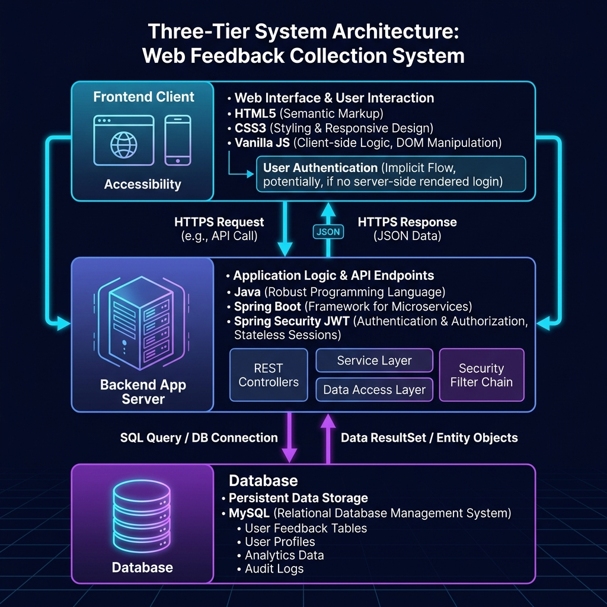
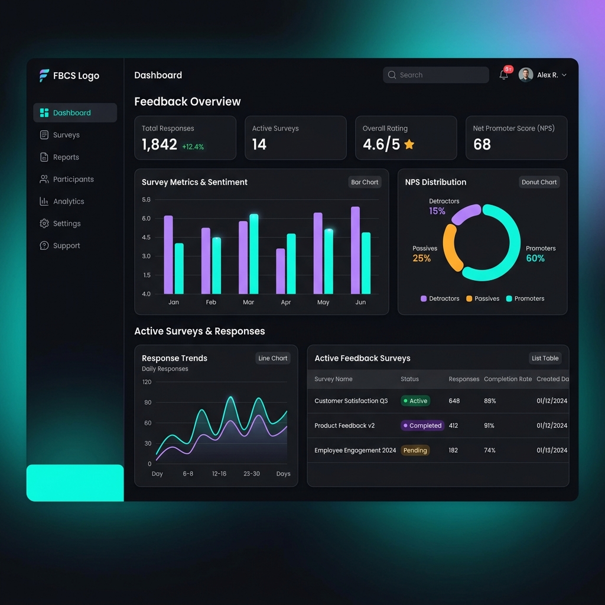
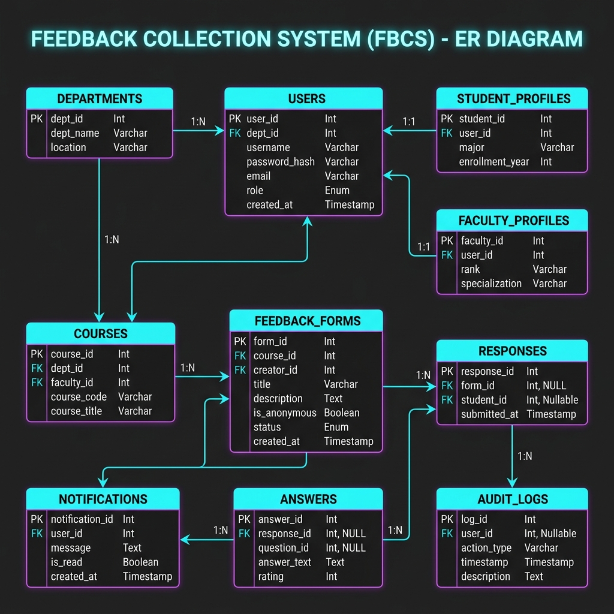

# 🎓 Feedback Collection System (FBCS)

[](https://spring.io/projects/spring-boot)
[](https://reactjs.org/)
[](https://www.mysql.com/)
[](https://jwt.io/)
[](https://railway.app/)
[](https://vercel.com/)
[](https://github.com/)

> An enterprise-grade, secure, role-based Feedback Collection and Course Evaluation platform engineered with **Spring Boot 3**, **React 18**, and **MySQL**.

---

## 📸 Screenshots & Visual Previews

### 🏛️ System Architecture


### 📊 Admin Analytics & Management Dashboard


### 🗄️ Relational Entity-Relationship (ER) Diagram


---

## 🌟 Key Features

### 👨‍💼 Administrator Portal
- **Form Builder Studio**: Create dynamic survey forms with 5-star ratings, single-choice options, checkboxes, and long-form text questions.
- **Academic Audience Targeting**: Target specific academic cohorts by Department (`CSE`, `ECE`, `MECH`), Semester, and Section.
- **Form Publishing**: Transition draft forms to active status with automatic validation.
- **User Management**: Filter and manage Student, Faculty, and Admin accounts with soft-deactivation.
- **Export Engine**: Stream single-click executive **PDF summary reports** and raw **CSV dataset exports**.

### 👨‍🏫 Faculty Portal
- **Course Feedback Analytics**: Real-time aggregation of student evaluation scores (e.g. `4.65 / 5.0`).
- **Response Metrics**: Live submission counts, participation rate percentage, and sentiment trends.
- **Anonymized Student Feedback**: Read qualitative student comments while preserving complete student anonymity.

### 👨‍🎓 Student Portal
- **Active Surveys Hub**: Immediate view of feedback forms assigned to the student's cohort.
- **Interactive Form Completion**: Intuitive star ratings, radio selectors, and feedback input.
- **Anonymity & Privacy**: Submissions are anonymized in faculty views.
- **Duplicate Protection**: Automatic duplicate response rejection.

---

## 🏗️ Architecture & Technology Stack

| Layer | Technologies Used |
| :--- | :--- |
| **Frontend** | React 18, React Router v6, Axios, Chart.js, React-Icons, CSS3 |
| **Backend** | Java 17, Spring Boot 3.5.x, Spring Data JPA, Spring Security 6 |
| **Authentication** | Stateless JWT (HMAC-SHA256), BCrypt Password Encryption (`$2a$10$...`) |
| **Database** | MySQL 8.x (15 Relational Tables with Foreign Key Cascades & Soft-Deletes) |
| **Reporting** | OpenPDF / iText (PDF Generation), OpenCSV (CSV Export) |
| **Container & Cloud** | Multi-Stage Dockerfile, Railway (Backend & MySQL), Vercel (Frontend SPA) |

---

## 🔑 Default Demo Accounts

The application automatically seeds the following accounts on first startup:

| Role | Email | Password | Accessible Portals |
| :--- | :--- | :--- | :--- |
| **👨‍💼 Administrator** | `admin@fbcs.local` | `admin123` | Dashboard, Form Builder, Users, Reports |
| **👨‍🏫 Faculty** | `faculty@fbcs.local` | `faculty123` | Course Feedback Analytics |
| **👨‍🎓 Student** | `student@fbcs.local` | `student123` | My Surveys & Submission Portal |

---

## 🚀 Quick Start (Local Setup)

### Prerequisites
- **Java 17+** & **Maven**
- **Node.js 18+** & **npm**
- **MySQL 8+** running on `localhost:3306`

---

### 1. Backend Setup

```bash
# Clone the repository
git clone https://github.com/shyamsunderreddypolu/feedback-collection-system.git
cd feedback-collection-system

# Configure MySQL in src/main/resources/application.properties
# spring.datasource.url=jdbc:mysql://localhost:3306/fbcs_db?createDatabaseIfNotExist=true
# spring.datasource.username=root
# spring.datasource.password=your_password

# Run the Spring Boot application
./mvnw spring-boot:run
```
> The backend will start on **`http://localhost:8080`**.

---

### 2. Frontend Setup

```bash
# Navigate to frontend folder
cd frontend

# Install dependencies
npm install

# Start the React development server
npm start
```
> The frontend will launch on **`http://localhost:3000`**.

---

## 🌐 Production Deployment

### 1. Backend on Railway
1. Create a **MySQL** database service on [Railway](https://railway.app/).
2. Create a new service from your GitHub repository using the included multi-stage `Dockerfile`.
3. The application automatically binds to Railway's MySQL environment variables (`MYSQLHOST`, `MYSQLPORT`, `MYSQLDATABASE`, `MYSQLUSER`, `MYSQLPASSWORD`) and dynamic `${PORT}`.

### 2. Frontend on Vercel
1. Import the repository on [Vercel](https://vercel.com/) with root directory set to `frontend/`.
2. Add the environment variable:
   - `REACT_APP_API_BASE_URL` = `https://<your-railway-backend-url>/api`
3. Click **Deploy**.

---

## 📡 REST API Reference

### 🔐 Authentication
- `POST /api/auth/login` - Authenticate user & issue JWT token
- `POST /api/auth/register` - Register a new user account

### 📝 Survey Forms & Questions
- `GET /api/forms/active` - Fetch all active surveys for current user
- `POST /api/forms` - Create draft feedback form *(Admin only)*
- `PUT /api/forms/{id}/publish` - Publish feedback form *(Admin only)*
- `POST /api/questions` - Add dynamic question item *(Admin only)*
- `POST /api/assignments` - Assign form to academic cohort *(Admin only)*

### ✍️ Submissions & Analytics
- `POST /api/submissions` - Submit survey response *(Student)*
- `GET /api/analytics/faculty/{facultyId}` - Get aggregate ratings & comments *(Faculty/Admin)*
- `GET /api/reports/export/pdf` - Download PDF Report *(Admin)*
- `GET /api/reports/export/csv` - Download CSV Dataset *(Admin)*

### 👥 User Management
- `GET /api/users/active` - List all active system users
- `GET /api/users/role/{role}` - Filter users by role (`ROLE_STUDENT`, `ROLE_FACULTY`, `ROLE_ADMIN`)
- `DELETE /api/users/{id}` - Soft-deactivate a user account

---

## 🧪 Testing & Quality Verification

```bash
# Run backend test suite (134 automated unit and integration tests)
./mvnw test
```

- **Backend Unit & Integration Tests**: `134 / 134 PASSED (100%)`
- **End-to-End Workflow Validation**: Full 11-step manual QA verification passed.

---

## 📄 License

This project is open source and available under the [MIT License](LICENSE).
